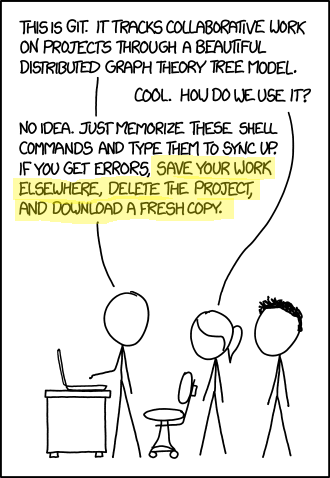

# Git rebase --live
live session on git rebase and mental model. 

## Introduction
XKCD `#1597` - Git.

example of a crazy git tree.
(branch, merge in main, rebase, and oopsie!)

## git rebase with no conflicts

points to hit:
- 🔢 Checksums change
- 🔄 Changes from main in branch
- 🚀 Remote push requires force

## git rebase with conflicts

points to hit:
- 🛑 Same line changed
- 🛠️ Git prompts resolution
- 🔄 Resolve each commit